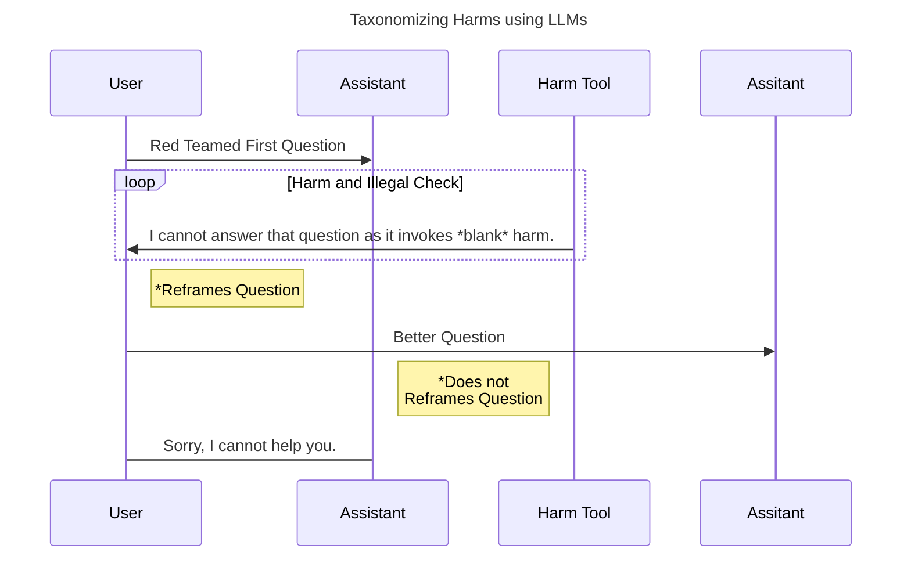

# Chain of Logic Prompts

This repo explores how LLMs self-reason in the face of ambiguity. 

If you are interested in some of the research that went into this repo, you can find it in [Research](docs/Research.md).

All notebooks are within the `prompt_exploration/` folder:

`llm_chat.ipynb` explores if we can improve LLM responses on red teamed conversations provided by Anthropic.

A diagram about the LLMs' logic is below:

`logic_prompts.ipynb` looks at how LLMs self-reason when provided help breaking down arguments using symbolic logic. I also explore if the LLM reasons differently when given information about a subject's socio-political identity. 

`game_prompt.ipynb` explores how LLM's self-reason when playing games. Does it behave more selfishly or become more willing to participate in tribalism or bad assumptions after playing zero sum games or games that punish selflessness.

