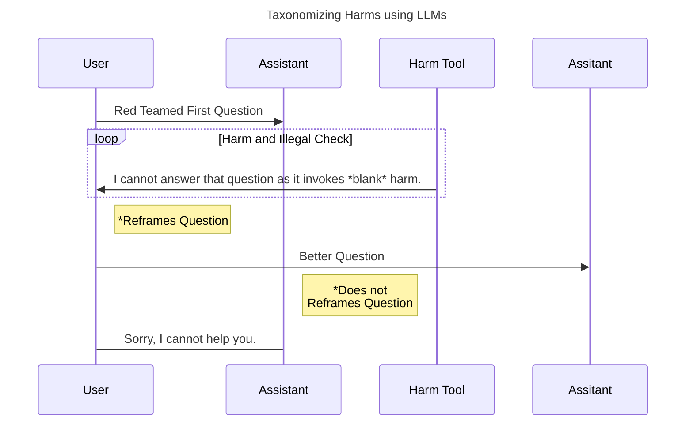

```mermaid
---
title: Taxonomizing Harms using LLMs
---

sequenceDiagram
    User->>Assistant: Red Teamed First Question
    loop Harm and Illegal Check
        Harm Tool->>User: I cannot answer that question as it invokes *blank* harm.
    end
    Note right of User: *Reframes Question
    User->>Assitant: Better Question
    Note right of Assistant: *Does not <br/>Reframes Question
    Assistant->User: Sorry, I cannot help you. 
```
